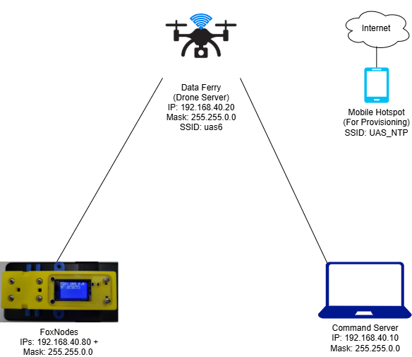

# [2024 First Responder UAS Wireless Data Gatherer Challenge UAS 6.0](https://www.nist.gov/ctl/pscr/open-innovation-prize-challenges/past-prize-challenges/2024-first-responder-uas-wireless)
**Disclaimer of Non-endorsement**:

Any references to commercial entities, products, services, or other non-governmental
organizations or individuals in this repository are provided solely for the information of
individuals using this document. These references are not intended to reflect the opinion of
NIST, the Department of Commerce or the United States, or its officers or employees. Such
references are not an official or personal endorsement of any product, person, or service, nor
are they intended to imply that the entities, materials, software, or equipment are necessarily the best
available for the purpose. Such references may not be quoted or reproduced for the purpose of
stating or implying an endorsement, recommendation, or approval of any product, person, or
service.

See License tab for licensing information.

**NOTE:** As defined in the software license, this sofware is provided "as-is," meaning that it may not receive future updates and may contain bugs/issues. This repository is provided for reference and archival purposes. Software included in this project may or may not implement "secure" mechanisms, code, configuration, and routines, in partial or whole. Those that do, may be out of date, contain bugs, compromised, not support "best secure practices," and/or contain legacy protocols that contain vulnurabalities.

## Repository Structure
```
Responder UAS Wireless Data Gatherer Challenge UAS 6.0/
├── data_ferry/                        # Drone Server / Command Server demo code
│   ├── 3D_print_case_models/		   # 3D Printer case files for Drone Server (To-Do)
│   ├── network_configuration/         # Configuration and apps to support network functions
│   ├── PKI_configuration/			   # Apps and support for mTLS and HTTPS
│   ├── server_app/					   # Drone server Python/Java application
│   ├── server_management/			   # GUI management and how-to
│   ├── software_installation/		   # Guide on what software to install on the Raspberry Pi
│   ├── system_install/			       # Guide on Raspberry Pi OS installation (To-Do)
│   └── README.md
│
├── docs/                               # Archival documentation from the challenge
│   ├── Network_Schema.drawio
│   ├── UAS_6.0_Official_Rules/
│   ├── UAS_6.0_Stage_2_Guidance/
│   └── UAS_6.0_Stage_3_Guidance/
│
├── foxnode/                            # FoxNode project (Post Competition)
│   ├── 3D_print_case_models/		    # 3D Printer case files for FoxNode
│   ├── libraries/						# Arduino libraries used in the project
│   ├── pcb_schematic/					# PCB Schematics and parts list for FoxNode companion board
│   ├── provision_secrets/				# Supporting PKI Arduino soure code and configuration for FoxNode HTTPS capabilities
│   ├── sample_outputs/					# JSON outputs from FoxNodes
│   ├── stateMachine/					# FoxNode project Arduino source code
│   └── README.md
│
├── pics/                               # Supporting pictures for repository
│
├── stage2_foxnode/                     # Older FoxNode code from Stage 2
│   ├── Foxclient_HTTP/					# Stage 2 FoxNode Arduino source code
│   └── README.md
│
├── stage3_foxnode/                     # Older FoxNode code from Stage 3
│   ├── libraries/						# Arduino libraries to support Stage 3 FoxNode
│   ├── stateMachine/					# Stage 3 FoxNode project Arduino source code
│   └── README.md
│
├── LICENSE.md							# NIST license and supporting libraries licenses
└── README.md                           # Project overview (this page)
```
## Project Components

- [Data Ferry](/data_ferry/README.md)
- [FoxNode Platform - Post Competition](/foxnode/README.md)
- [Stage 2 FoxNode](/stage2_foxnode/README.md)
- [Stage 3 FoxNode](/stage3_foxnode/README.md)


## Terminology
- The sensor device or "IoT-sensor" is referred to as "sensor(s)" or "FoxNode(s)".
- The drone collecting the data (from the FoxNodes) is referred to as "data ferry", "drone server", or simply "server."
- The device receiving the data from the data ferry is referred to as the "command server".

Note that conflicts may be present regarding terminology and alignment between the reference code and historical documentation. Above terms will be used interchangeably throughout.

## Scope
This repository contains the reference software for the FoxNode (Ground-based IoT-Sensor), hardware schematics, 3D-print files, and challenge documentation for the UAS 6.0 Challenge. It also includes PSCR-developed servers (data ferry and command server) for system testing. The intent of this repository is not only to preserve the software and hardware schematics used in UAS 6.0, but also to serve as a guide for building and replicating the sensor hardware and associated software components used in the competition. Documentation includes UAS 6.0 Official Rules and Guidance documents for Stages 2 and 3. With this information, one could replicate and run the entire UAS 6.0 challenge. Stage 2 and 3 FoxNode code is provided for historical reference and "Post Competition" code is provided that contains additional added enhancements since the compeition conculded.

The "product" of this repository is a ground-based IoT-sensor, based on the Espressif ESP32 System-on-Chip platform that "senses" or generates data, including light levels or lux, temperature, humidity, pressure, accelerometer or motion, associated time stamps, and system-on-chip compute statuses. The system then transmits JSON-formatted data in an HTTP POST message to a predetermined IP address over Wi-Fi. The associated sensor product is extensible to include global positioning system (GPS) data, among other sensors that support the I2C bus. Associated data objects or "placeholders" are present for GPS extensions in the provided code.

A secondary "product" is a Python-based Flask web server for replicating the Data Ferry (Drone Server) and combo Command Server components. Both of these components were required deliverables by challenge participants in Stage 3, but the PSCR lab version is included here for systems-based testing and ongoing development.

## Competition Background
The First Responder Uncrewed Aircraft Systems (UAS) Wireless Data Gatherer Challenge, otherwise known as UAS 6.0, was the sixth competition in the National Institute of Standards and Technology (NIST) Public Safety Communications Research (PSCR) Division’s UAS prize challenge series, which took place between May 2024 and concluded in April of 2025. The challenge evaluated the feasibility and operational value of using UAS as mobile data ferries to support situational awareness in public safety scenarios characterized by sparse, partitioned, or infrastructure-limited communications environments.

Unlike traditional data ferry architectures that rely on delayed, store-and-forward data delivery between disconnected network segments, UAS 6.0 demonstrated how modern commercial UAS platforms, combined with high-power radios, modular payloads, and standardized application interfaces, can enable near real-time data collection and delivery to incident command. During live field evaluations, multiple teams successfully located distributed wireless sensors, collected environmental data, and delivered actionable information to a command server within minutes, and in some cases, seconds, of acquisition. These capabilities significantly reduced latency compared to legacy data ferry concepts, enabling time-critical decision-making for first responders.

Results showed that UAS-based data ferries equipped with wide-area communications systems and operator-friendly interfaces provided measurable advantages in coverage, responsiveness, and situational awareness. At the same time, findings highlighted current limitations in autonomous flights, the importance of skilled human operators, and the need for expanded measurement science to evaluate communications performance, interference, and scalability. Collectively, the challenge outcomes will inform future public safety communications research and demonstrate a practical path toward deploying UAS-enabled data ferry systems using commercially available technologies.

## UAS 6.0 Competition Stages
**Stage 1**: A proof-of-concept phase that evaluated prototypes based on academic-style paper submissions. In this and subsequent stages, participants followed the rules outlined in the [UAS 6.0 Official Rules](docs/UAS_6.0_Official_Rules.pdf) document, located in the "docs" section of this repository.

**Stage 2**: Stage two took place at participants' home locations, and associated tests were conducted using video assessment methods. The sensor developed in this stage was a minimal viable verification system used for basic message exchange with built-in or "canned" data-generating mechanisms. Details on how this system was implemented and associated tests can be found in the [Guidance for Stage 2](docs/UAS_6.0_Stage_2_Guidance.pdf) document, located in the "docs" section of this repository. This section is included for historical reference. Anyone looking to replicate or build on elements from UAS 6.0 should start in the FoxNode section for Stage 3.

**Stage 3**: UAS prize challenge participants competed in-person event to perform NIST-standardized tests and collect data from sensors placed throughout the competition theater. The sensor developed in this stage generated and transmitted environmental data in JSON format from various sensing components. The sensor included a communications state machine to improve data delivery. Details on how this system was implemented and the associated tests can be found in  [Guidance for Stage 3](docs/UAS_6.0_Stage_3_Guidance.pdf) document, located in the [docs](/docs) section of this repository.

# UAS 6.0 Network Architecture

It is important to consider how you plan to deploy the FoxNode sensors and associated servers in your network deployment if you choose to develop on this project.
The following is a greatly simplified architecture that was used in the UAS 6.0 Stage 3 competition. All coded configurations in this repository follow this general schema if you intend to replicate this experiment.



The diagram above shows the three primary components used in UAS 6.0.

- The [Data Ferry](data_ferry/) is the central component configured as a Wi-Fi access point or hotspot. The IP assigned (static provisioning) to the Data Ferry is 192.168.40.20. The mask is 255.255.0.0.

- The [FoxNodes](foxnode/) connect to the Data Ferry when it is in range. FoxNodes are assigned DHCP address (first choice), and failover to "static" IP addresses 192.168.40.80 + FoxNode ID. For example, FoxNode 1 is assigned 192.168.40.81. The mask is 255.255.0.0. These values are statically set.

**NOTE:** A 255.255.0.0 or /16 "classless" 192.168.0.0 network was chosen for extensiblity in the final stage 3 competition; however, this is not typical, nor scalabale in most designs. It is recommended to use a network design that fits your application and architecture.

- The Command Server is assigned 192.168.40.10, mask 255.255.0.0. This is statically set. For examples in this repository, this is a simple PC client with web browsing capabilities and can be any non-conflicting address in the /16 space.

- Internet connectivity is not considered in this architecture to limit scope and to simulate "no" or "limited" connectivity often observed in first responder scenarios, such as wildfires. However, a mobile hotspot or alternative Wi-Fi connection is recommended for provisioning purposes.

# Project status
Development status for PSCR - UAS 6.0 First Responder UAS Data Gatherer Challenge
- The UAS 6.0 challenge and associated "works" are considered "complete and finished."
- This repository is for historical reference, and may not receive future updates; however, other PSCR projects may utilize some or all of this project for continued development. 
- Individuals who have questions or are interested in this project or current/future PSCR UAS projects, please contact us at the email address below.

# Recommended To-dos and Implementations
- Deployment package or iso of Data Ferry

# Contact
psprizes@nist.gov
- This mailbox is part of a distrubution that is checked regularly.


